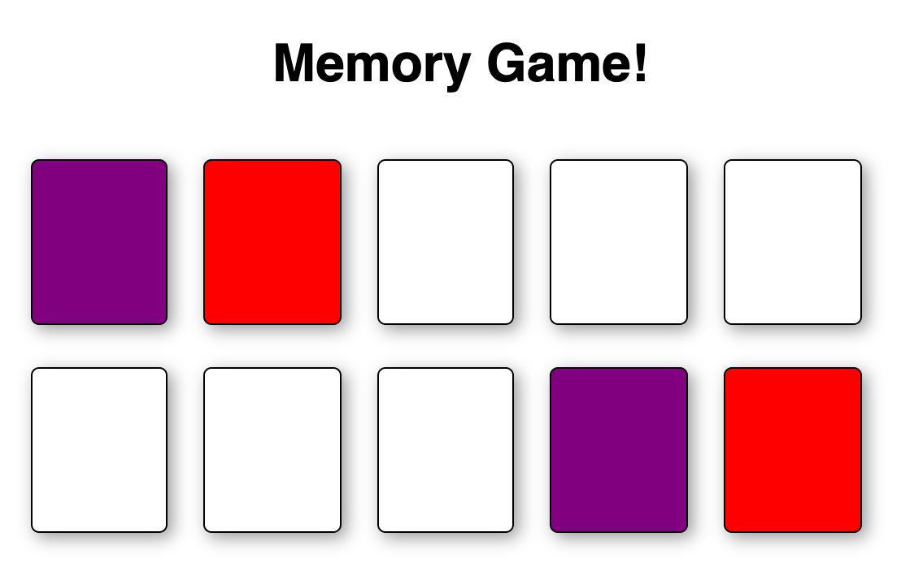

# Memory Game

For this assignment, you'll be building a memory game in the browser using HTML, CSS, and JavaScript. Your goal is to build a card-based memory game.

Players will be shown a collection of cards, face down, and can click on a card to reveal what's underneath.

After clicking on two cards, the game should check to see whether they match. If they do, they will remain facing up.

If not, the cards should remain displayed to the player for one second, and then flip back down.

The goal of the game is to match up all the pairs.

You can find a 30 second video demo of a possible solution [here](https://drive.google.com/file/d/1HeBfQe-AGnFGL8YmEt2wnfEwnNL0abFJ/view).

You should submit a zip file containing your code as part of this assessment.

## Part One: Reading the code

Take a look at the starter code provided.

- We have an array of colors which we shuffle and then loop over to create 10 div elements on the page and give them a class of the color we loop over.
- We then append the div elements to the DOM and add an event listener for a "click" for each of the elements.

Make sure to read through the code before continuing on!

## Part Two: Implementing clicks and matches

- Clicking a card should change the background color to be the color of the class it has.
- Users should only be able to change at most two cards at a time.
- Clicking on two matching cards should be a "match" — those cards should stay face up.
- When clicking two cards that are not a match, they should stay turned over for at least 1 second before they hide the color again. You should make sure to use a setTimeout so that you can execute code after one second.

## Part Three: Gotchas

- Make sure this works only if you click on two different cards — clicking the same card twice shouldn't count as a match.
- Make sure that you cannot click too quickly and guess more than two cards at a time.

## Further Study

- Add a button that when clicked will start the game.
- Add a button that when clicked will restart the game once it has ended.
- For every guess made, increment a score variable and display the score while the game is played.
- Store the lowest-scoring game in local storage, so that players can see a record of the best game played.
- Allow for any number of cards to appear, rather than always using the same deck.
- Instead of hard-coding colors, try something different like random colors or even images.

